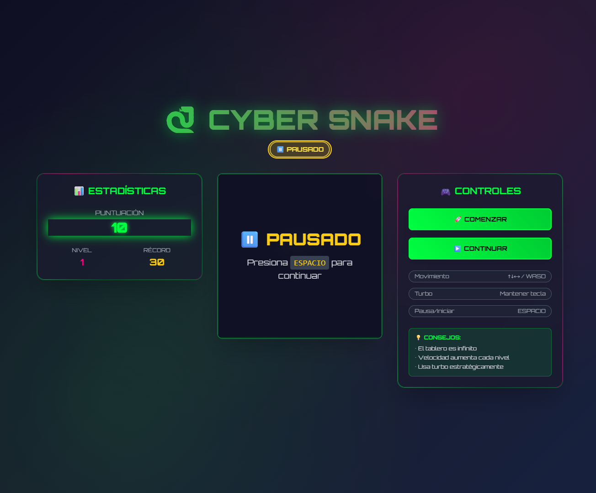

<p align="center">
  <a href="http://nipoanz.com/" target="_blank" rel="noopener noreferrer">
  
  </a>
</p>

# 🐍 CYBER SNAKE

Modern Snake Game built with Angular 17, TypeScript, Tailwind CSS & SCSS

<p align="center">
  
</p>

---

## Table of Contents
1. [Introduction](#introduction)
2. [Objective](#objective)
3. [Features](#features)
4. [Tech Stack](#tech-stack)
5. [Installation](#installation)
6. [Usage](#usage)
7. [Game Controls](#game-controls)
8. [Architecture](#architecture)
9. [Author](#author)
10. [License](#license)
11. [Contributing](#contributing)

---

## Introduction

Cyber Snake is a modern reinterpretation of the classic Snake game, built with cutting-edge web technologies. The game features a futuristic neon design, smooth animations, responsive controls, and an infinite playing field. It combines nostalgic gameplay with contemporary visual effects and user experience design.

---

## Objective

Create a highly engaging, visually stunning Snake game that showcases modern web development practices:

- **Responsive Design**: Works seamlessly on desktop and mobile devices
- **Modern UI/UX**: Cyber-themed interface with glassmorphism effects
- **Performance Optimized**: Smooth 60fps gameplay with efficient rendering
- **Accessibility**: Keyboard controls and visual feedback systems
- **Progressive Features**: Turbo mode, infinite board, and dynamic difficulty

---

## Features

### Core Gameplay
- **Classic Snake mechanics** with modern twists
- **Infinite playing field** - no wall collisions
- **Progressive difficulty** - speed increases with each level
- **Turbo mode** - hold movement keys for speed boost
- **Score system** - points and high score tracking
- **Local storage** - persistent high score records

### Visual Design
- **Cyber/Neon aesthetic** with glowing effects
- **Glassmorphism UI** - translucent panels with blur effects
- **Animated elements** - smooth transitions and micro-interactions
- **Responsive layout** - adapts to different screen sizes
- **Custom animations** - particle effects and gradient borders

### Technical Features
- **Angular 17** - Latest framework features
- **TypeScript** - Type-safe development
- **Tailwind CSS** - Utility-first styling
- **SCSS** - Advanced styling capabilities
- **Canvas API** - High-performance rendering
- **Modular architecture** - Clean, maintainable code

---

## Tech Stack

### Frontend Framework
- **Angular 17** - Component-based architecture
- **TypeScript** - Static typing and modern JavaScript features
- **RxJS** - Reactive programming for game state management

### Styling & Design
- **Tailwind CSS** - Utility-first CSS framework
- **SCSS** - Advanced CSS preprocessing
- **Custom CSS Variables** - Dynamic theming system
- **CSS Animations** - Hardware-accelerated transitions

### Game Engine
- **HTML5 Canvas** - High-performance 2D rendering
- **RequestAnimationFrame** - Smooth 60fps animation loop
- **Keyboard Event Handling** - Responsive input system
- **LocalStorage API** - Data persistence

### Development Tools
- **Angular CLI** - Development server and build tools
- **Node.js & npm** - Package management
- **PostCSS** - CSS processing pipeline
- **Autoprefixer** - Cross-browser compatibility


---

## Installation

### Prerequisites
- Node.js (v18 or higher)
- npm or yarn package manager
- Modern web browser

### Setup Instructions

1. **Clone the repository:**
```bash
git clone https://github.com/potier97/snake-game.git
cd snake-game
```

2. **Install dependencies:**
```bash
npm install
```

3. **Install Tailwind CSS (if not already configured):**
```bash
npm install -D tailwindcss postcss autoprefixer
npx tailwindcss init
```

4. **Start the development server:**
```bash
npm start
```

5. **Open your browser:**
```
http://localhost:4200
```

### Build for Production

```bash
npm run build
```

The build artifacts will be stored in the `dist/` directory.

---

## Usage

### Starting the Game
1. Open the application in your browser
2. Click "COMENZAR" or press `SPACEBAR` to start
3. Use arrow keys or WASD to control the snake
4. Collect food items to grow and increase your score
5. Avoid hitting yourself - the game ends on self-collision

### Game Modes
- **Normal Mode**: Standard gameplay speed
- **Turbo Mode**: Hold any movement key for increased speed
- **Infinite Board**: Snake wraps around screen edges

### Scoring System
- **+10 points** per food item consumed
- **Level progression** every 50 points
- **Speed increase** with each level
- **High score** automatically saved locally

---

## Game Controls

| Control | Action |
|---------|--------|
| `↑` or `W` | Move Up |
| `↓` or `S` | Move Down |
| `←` or `A` | Move Left |
| `→` or `D` | Move Right |
| `SPACEBAR` | Start/Pause/Resume |
| `Hold Movement Key` | Turbo Mode |

### Special Features
- **Anti-collision system**: Prevents accidental reverse moves
- **Directional buffer**: Smooth input handling
- **Pause functionality**: Game state preservation
- **Auto-restart**: Quick replay after game over


---

## Architecture

### Component Structure
```
src/
├── app/
│   ├── snake-game/
│   │   ├── snake-game.component.ts
│   │   ├── snake-game.component.html
│   │   └── snake-game.component.scss
│   ├── app.component.ts
│   └── app.module.ts
├── assets/
├── styles.scss
└── index.html
```

### Key Classes and Interfaces
- **SnakeGameComponent**: Main game logic and rendering
- **GameState**: Enum for game states (Ready, Playing, Paused, GameOver)
- **Position**: Interface for coordinate system
- **Game Loop**: RequestAnimationFrame-based animation cycle

### State Management
- **Component-based state**: Angular reactive patterns
- **Local storage**: High score persistence
- **Event-driven**: Keyboard input handling
- **Lifecycle hooks**: Proper cleanup and initialization

---

## Author

**[Nicolás Potier](https://github.com/potier97)** 

---

## License

This project is licensed under the MIT License - see the [LICENSE](LICENSE) file for details.

---

## Contributing

Contributions, issues, and feature requests are welcome! Feel free to check the [issues page](https://github.com/potier97/snake-game/issues).

### How to Contribute

1. **Fork the repository**
2. **Create a feature branch:**
```bash
git checkout -b feature/amazing-feature
```

3. **Make your changes and commit:**
```bash
git commit -m 'Add some amazing feature'
```

4. **Push to the branch:**
```bash
git push origin feature/amazing-feature
```

5. **Open a Pull Request**

### Development Guidelines
- Follow Angular style guide
- Use TypeScript strict mode
- Write meaningful commit messages
- Add comments for complex logic
- Test your changes thoroughly
 

---
 

<p align="center">
  Made with ❤️ by <a href="https://github.com/potier97">Nicolás Potier</a>
</p> 